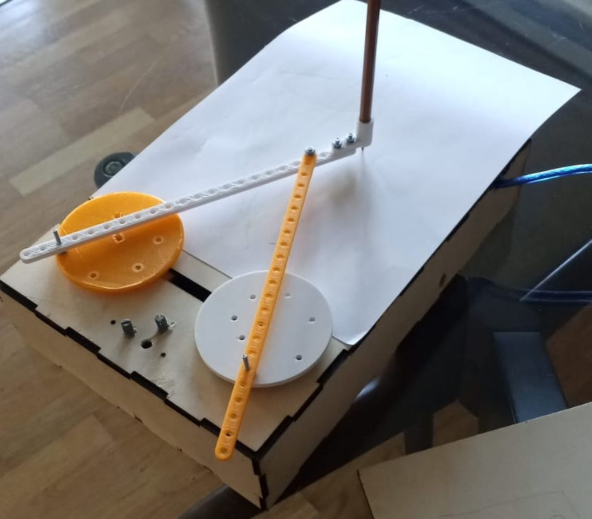

# Pintógrafo

> **ATENÇÃO** — *Work in progress*, este repositório ainda está em fase inicial e bastante incompleto, pelo que não contém toda a informação para completar o projeto.

Este repositório contém instruções detalhadas para a construção de uma máquina de desenho digital, baseada nos princípios do pantógrafo de ampliação.

A construção de uma máquina de desenho semelhante à apresentada na figura acima é composto de 3 sistemas que serão construídos em separados: **Chassi**, **Impressão 3D** e **Electrónica**, que podem ser encontradas nas pastas deste repositório.

Na pasta briefing encontram-se um manual de instruções para a construção desta máquina de desenho digital.
