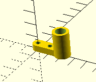

DRAFT: \today
\tableofcontents

# Máquina de Desenho - Pintógrafo[^1]
[^1]: O nome Pintógrafo não é um nome técnico, mas antes um nome inventado pela filha de [Fran McConville](https://www.fxmtech.com/harmonog.html), um construtor destas máquinas. No entanto o nome começou a ser utilizado de forma genérica para designar estas máquinas de desenho. Neste documento vamos utilizar o nome pintógrafo.

Instruções de construção de uma máquina de desenho baseada nos princípios de um pantógrafo.

{width=10cm}

A construção de uma máquina de desenho semelhante à apresentada na figura acima é composto de 3 sistemas que serão construídos em separados: Chassi, Partes móveis e Electrónica.

{width=10cm}

Há diversas máquinas de desenho baseadas nos mesmos princípios. Os espirógrafos utilizam uma mesa rotativa ou sistemas de rodas dentadas para produzir efeitos circulares. 

{width=8cm}

Os Harmonógrafos são semelhantes mas utilizam pêndulos para criar o movimento harmónico que gera o movimento. 

No website <https://michaldudak.github.io/pintograph/demo/> podes encontrar diversas simulações de pintógrafos com diferentes características de montagem e comparar os resultados de cada um.

## Chassi
O chassi deste projecto dará suporte aos componentes electrónicos, aos braços móveis e também ao papel utilizado para os desenhos. Na sua essência é uma caixa que será recortada a Laser em madeira de $3mm$ de espessura. 

### Construção da Caixa

{width=10cm}

O chassi está pensado para o tamanho A4 (tamanho máximo de corte a Laser no Lab Aberto)

A geração da caixa deve ter as dimensões A4 ($297\times210mm$) e uma altura de $60-70mm$ para poder albergar os componentes electrónicos dentro da mesma. 

Para criar os templates da caixa vamos utilizar o website MakerCase — <https://www.makercase.com/> — onde definimos as partes necessárias da caixa para posterior corte na máquina a Laser.  

{width=10cm}

Faz download do ficheiro resultante e abre-o no InkScape ou Adobe Illustrator. Deverás ter algo semelhante à figura.

### Recortes

A caixa tal como foi descarregada está totalmente fechada. Vai ser necessário fazer recortes extra para colocar os componentes móveis e eléctricos. Nomeadamente haverá recortes para:\nota{Será facultado um template em SVG para os recortes, para a máquina básica, mas deves desenhar o teu para a tua versão da máquina. Deves medir rigorosamente todas as dimensões e realizar o desenho em InkScape ou Illustrator.}

- Tomada USB do Arduino num tampo lateral. Poderá ser feito a Laser ou com um berbequim com uma broca larga.
- Recortes para encaixe do motor, potenciometros e outros componentes no tampo superior da máquina. Estes recortes serão feitos num desenho SVG para que a tampa possa ser de seguida recortada a Laser.

## Partes móveis

As partes móveis correspondem aos braços de pantógrafos que conectam os discos de rotação e a caneta de desenho aos motores. 

{width=10cm}

> Vê o que é um pantógrafo e estuda o princípio de funcionamento na [wikipédia](https://en.wikipedia.org/wiki/Pantograph) — <https://en.wikipedia.org/wiki/Pantograph> — e [youtube](https://www.youtube.com/watch?v=Muic3yyhSv8) — <https://www.youtube.com/watch?v=Muic3yyhSv8>

Estas peças serão realizadas através de fabricação aditiva — impressão 3D em PLA.

### Braços do pintógrafo.

{width=8cm}

Os Braços do pintógrafo devem ser modelados com orifícios regularmente espaçados. Desta forma será possível utilizar diferentes posições para fazer a montagem e produzir desenhos diferentes.

A altura dos braços pode ser limitada a $4mm$ e o comprimento de cada braço não deve exceder os $200mm$. Os orifícios devem ser dimensionados de acordo com os veios e parafusos a utilizar. Tipicamente $3mm$ são apropriados.

### Discos de rotação.

{width=7cm}

Os discos de rotação servem para colocar o ponto de fixação dos braços. Colocando diverso orifícios com diferentes raios podes experimentar e obter diferentes tipos de desenhos. 

Os discos de rotação podem ser simples ou podem ser compostos por mais do que um disco, normalmente interligados por um sistema de rodas dentadas como no exemplo acima.

### Suporte de caneta.

{height=3cm}

\nota{Um lápis típico normalmente tem $8mm$ de diâmetro. No entanto uma caneta BIC é ligeiramente maior. Pensa se podes fazer uma versão de suporte universal, por exemplo recorrendo à utilização de um elástico.}
O suporte de caneta deverá ser pensado para dar estabilidade à caneta. Um tubo com o diâmetro aproximado de $8-10mm$ pode ser apropriado desde que este possua um orifício onde se possa colocar um parafuso para fixar a caneta no local. 

## Electrónica

XXXXXX

# Sugestões de melhoria do pintógrafo

Até esta secção construíste um pintógrafo simples, com 2 braços, dois discos de rotação, 2 steppers e 2 potenciometros. Neste momento a máquina está funcional, mas como podes ver, não é muito original, uma vez que fará desenhos simples e iguais às restantes máquinas. 

Está na altura de melhorar a máquina consoante a tua criatividade e conceito. Aqui ficam algumas sugestões de melhoria do teu pintógrafo, mas podes sugerir outras alterações que serão analisadas pelos professores. 

### Acrescentar uma mesa de papel rotativa.

{width=10cm}

Se adicionares um 3º motor podes construir um mesa rotativa no centro da área de desenho e dessa forma obter efeitos mais próximos de um espirógrafo.

### Acrescentar novos discos na extremidade dos discos de rotação.

A forma mais completa do pintógrafo inclui um segundo conjunto de discos na extremidade dos primeiros. A utilização destes discos permite uma amplitude de movimentos maior resultando em desenhos mais variados que os do pintógrafo simples.

### Acrescentar um microfone.

Se adicionares um microfone podes criar um sistema de gravação de voz ou de música. A registo em papel será o resultado da captação da realidade ficando para sempre registada. Os teus utilizadores podem assim obter uma representação visual da sua voz, de uma música, ou de qualquer outra experiência sonora.

### Acrescentar um sensor de temperatura e humidade. 

Semelhante ao que acontece numa estação meteorológica, podes adicionar um sensor de temperatura e humidade e dessa forma registar em papel o estado do ambiente. Podes redesenhar e programar a tua máquina para fazer um desenho por dia.

### Controlar se a caneta risca ou não o papel

Podes adicionar um pequeno servo ao suporte da caneta de forma a que o desenho da linha não seja contínuo. O pequeno servo irá afastar ou colocar a caneta no papel. O controlo deste processo pode ser feito através de um botão na própria caixa ou programaticamente. 

### Acrescentar uma interface capacitiva 

As interfaces capacitivas permitem integrar um controlo digital que responda ao toque. Coloque uma interface capacitiva de forma a que a velocidade dos motores seja controlada pelo toque do utilizador.

### Crie uma interface animada em p5js

Construa uma animação no P5js de forma a que a máquina de desenho comunique bidireccionalmente com o computador. A animação enviará comandos do utilizador para a máquina de desenho e em simulatâneamente animará um sketch baseado no estado da máquina (posição dos potenciometros, motores, sensores, etc.)

### Conecte duas máquinas de desenho

Conecte duas máquinas entre si utilizando o protocolo I2C ou Serial de forma a que os sensores de uma máquina afectem a outra. 

# Repositório

No repositório deste projeto, localizado em >https://github.com/sixhat/Pintografo> pode encontrar ficheiros template para as diversas fases do projecto. Estes ficheiros serão bons pontos de partida para desenvolver os seus próprios modelos. 